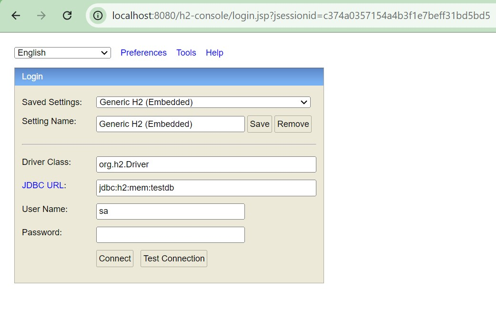

# Job Posting API

This project is a simple Job Posting API built using Spring Boot. The API provides CRUD operations for managing job postings on a hiring platform. It includes search functionality, error handling, and API documentation using Swagger.

## Features

- **CRUD Operations**: Create, Read, Update, Delete job postings.
- **Search Functionality**: Search job postings based on keywords, location, and required skills.
- **Error Handling**: Robust error handling for invalid requests or database exceptions.
- **API Documentation**: Auto-generated API documentation using Swagger.

## Technologies Used

- **Spring Boot**: Framework for building the RESTful API.
- **H2 Database**: In-memory database for data storage.
- **Spring Data JPA**: For data access and manipulation.
- **Swagger**: For API documentation.
- **JUnit & Mockito**: For testing.

## Getting Started

### Prerequisites

- Java 17 or higher installed on your machine.
- Maven installed for building the project.

### Installation

1. **Clone the repository:**

    ```bash
    git clone https://github.com/yourusername/job-posting-api.git
    cd job-posting-api
    ```

2. **Build the project using Maven:**

    ```bash
    mvn clean install
    ```

3. **Run the application:**

    ```bash
    mvn spring-boot:run
    ```

### Accessing the Application

1. **Access the H2 Console:**

    - The H2 database console is available at: [http://localhost:8080/h2-console](http://localhost:8080/h2-console)
    - **JDBC URL**: Use `jdbc:h2:mem:testdb` (as configured in `application.properties`).
    - **User Name**: `sa`
    - **Password**: Leave it blank.
  
   

2. **Access Swagger API Documentation:**

    - Swagger UI is available at: [http://localhost:8080/swagger-ui.html](http://localhost:8080/swagger-ui.html) or [http://localhost:8080/swagger-ui/](http://localhost:8080/swagger-ui/)
    - Swagger provides a user-friendly interface to interact with the API, view available endpoints, and test API calls.

## How to Use the API

Here’s how you can use the API to manage job postings:

1. **Create a Job Posting:**

    - **Endpoint**: `POST /api/job-postings`
    - **Request Body Example**:

    ```json
    {
        "title": "Software Engineer",
        "description": "Develop and maintain software solutions.",
        "location": "New York, NY",
        "company": "TechCorp Inc.",
        "salaryRange": "80,000 - 100,000",
        "requiredSkills": ["Java", "Spring Boot", "REST"],
        "applicationDeadline": "2024-12-31"
    }
    ```

2. **Get All Job Postings:**

    - **Endpoint**: `GET /api/job-postings`

3. **Get a Job Posting by ID:**

    - **Endpoint**: `GET /api/job-postings/{id}`
  
4. **Update a Job Posting:**

    - **Endpoint**: `PUT /api/job-postings/{id}`
    - **Request Body**: Similar to the create endpoint.

5. **Delete a Job Posting:**

    - **Endpoint**: `DELETE /api/job-postings/{id}`

6. **Search Job Postings:**

    - **Endpoint**: `GET /api/job-postings/search?keyword={keyword}&location={location}&skills={skills}`
    - **Example**: `GET /api/job-postings/search?keyword=engineer&location=New York&skills=Java`

## Data Model

The `JobPosting` entity includes the following fields:

- `id` (Long): Unique identifier for the job posting (auto-generated).
- `title` (String): Title of the job posting.
- `description` (String): Description of the job.
- `location` (String): Location of the job.
- `company` (String): Name of the company.
- `salaryRange` (String): Salary range for the job.
- `requiredSkills` (List of Strings): List of required skills for the job.
- `applicationDeadline` (Date): Deadline for job applications.

## Testing

- Unit tests are written using JUnit and Mockito.
- To run tests, use the following command:

    ```bash
    mvn test
    ```

## Error Handling

- Custom error messages are returned for invalid inputs or database exceptions.
- Proper HTTP status codes are used for success and error scenarios.

## API Documentation with Swagger

- The API documentation is automatically generated using Swagger.
- You can access the Swagger UI to view and test all available endpoints.
- Swagger UI URL: [http://localhost:8080/swagger-ui.html](http://localhost:8080/swagger-ui.html)

## License

This project is licensed under the MIT License - see the [LICENSE](LICENSE) file for details.

## Contributing

1. Fork the repository.
2. Create a feature branch (`git checkout -b feature-branch-name`).
3. Commit your changes (`git commit -m 'Add some feature'`).
4. Push to the branch (`git push origin feature-branch-name`).
5. Open a pull request.

## Contact

For questions or support, please contact [Kameswar Panda](mailto:your.kameswarpanda11@gmail.com).
